# Course 1 - Week 2

## 1. Binary Classification

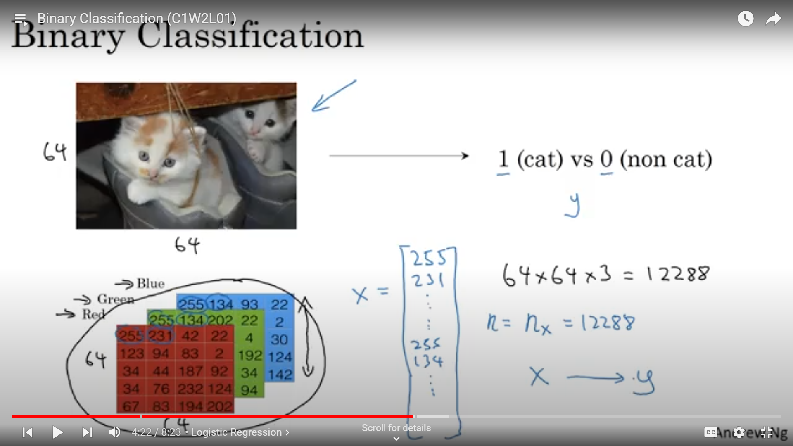

In binary classification we have output of the form 0 or 1 i.e is something present or not, in this case is a cat present(1) or not(0).

'X' is the feature matrix which contains pixel by pixel information in the form of 1D vector(matrix) and 'n' is the dimension of the feature matrix and 'y' is the output(1 if feature is present else 0).

Let's consider we have 'm' images in training set,
X.shape = (n,m)

## 2. Logistic Regression

Logistic regression is an algorithm for binary classification.

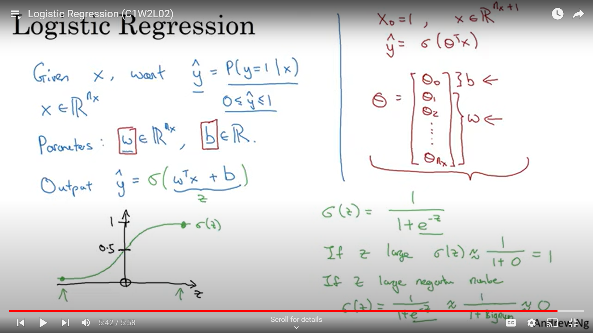

In logistic regression we use the sigmoid activation function to get the ouput between 0 & 1. Basically, we get the probability of an object being present.

Now, we set a threshold for classification for example: if output>0.5 print 1 else 0, making it an appropriate algorithm for binary classification.

## 3. Logistic Regression Cost Function

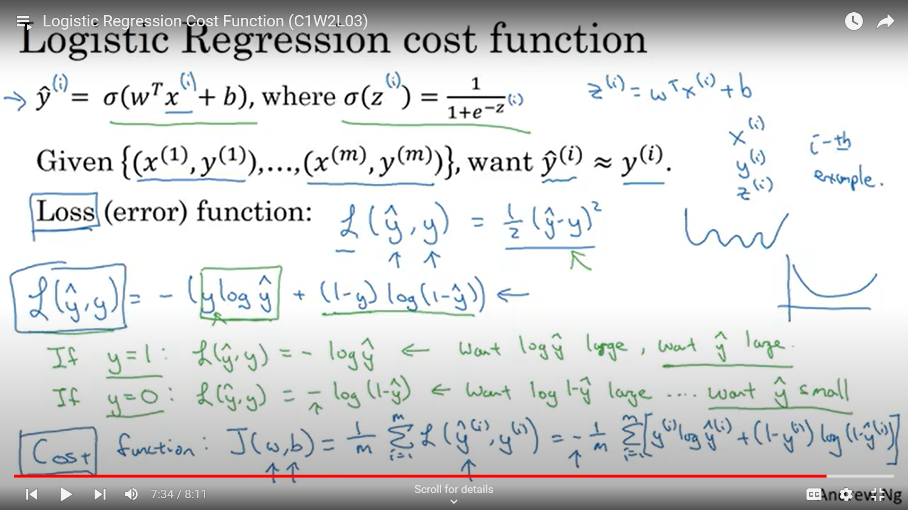

In logistic regression the feature matrix $ X $ is basically pixel by pixel information of the given input(training) image.

$W$ is the matrix containing the respective weighted parameters of the features present in feature matrix.

Bias $b$ is a real number in case of one input & a broadcasted matrix of dimension (1,$m$) in case of $m$ inputs.

$ \hat{y} $ is the probability given as output by logistic regression and $ y $ is the expected output.

We want $ \hat{y} $ & $ y $ as close to each other as possible.

For this we need to calculate loss function which will modify the parameters to achieve what we want.

Loss function basically calculates the error(difference) between the output recieved and expected output. We want to minimize the loss function which it does by arranging the parameters accordingly after each training case.

Cost function is basically the total error(difference) over the whole dataset. Mathematically, it is the mean of all the loss functions of individual data inputs.

## 4. Gradient Descent

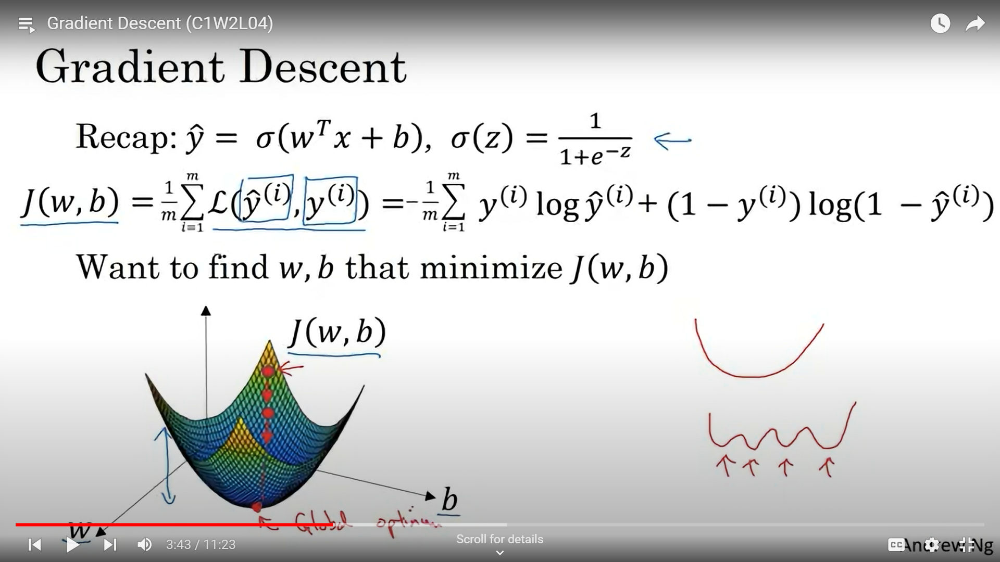

Our aim is to find the values of $ w $ & $ b $ for which our cost function $ J $ is minimum.

First we randomly initialize values of $ w $ & $ b $ and then update their values as given in the image below until the value coverges.

This is known as gradient descent as we can see from the graph that we continue to descent until we reach the global optimum.

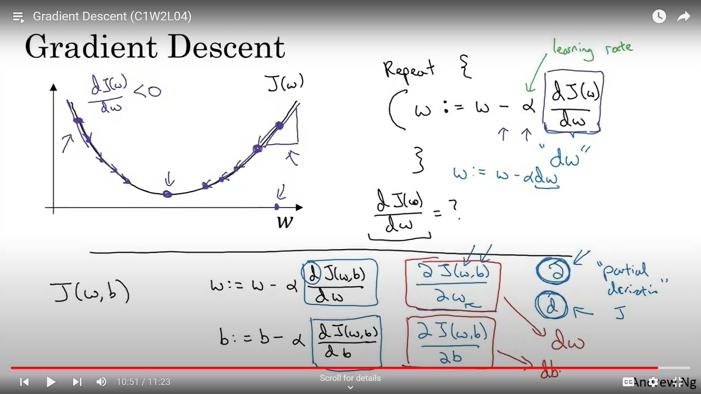

## 5. Computation Graph

Finding the output $ \hat{y} $ is the forward propagation step & finding the minimum cost function using gradient descent is the back propagation step.

The image below shows both forward and back propagation.

Calculating $ dv $ is first step(level) of back propagation and $ da $ & $ du $ are the second step(level) while $ db $ & $dc $ are third step(level) of back propagation.
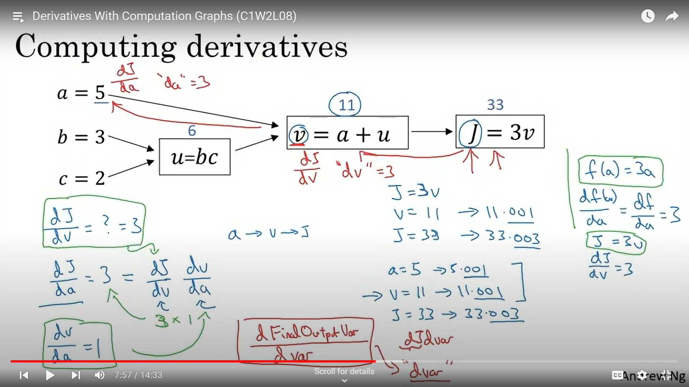

In the image below it shows how the derivatives are calculated which are needed to update the values of the parameters $ w1 $ , $ w2 $ & $ b $ until the values converge and eventually we find the minimum cost function $ J $.
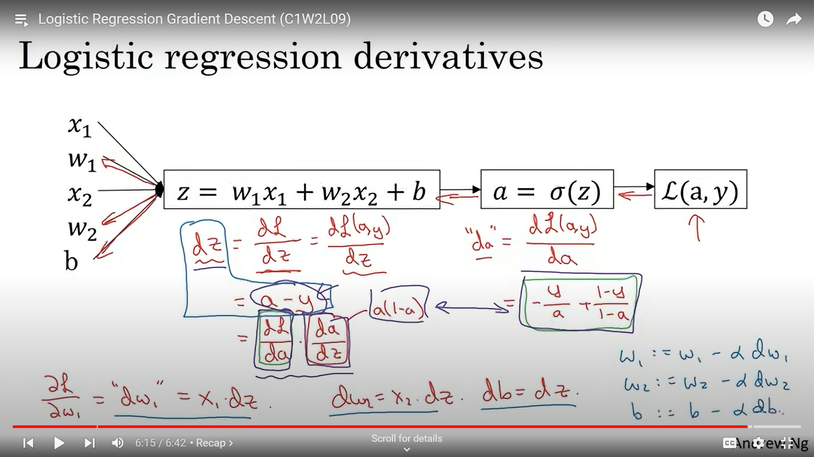

If we have a dataset with m inputs, then we find the mean of the derivatives and use that mean to update the values of the parameters.

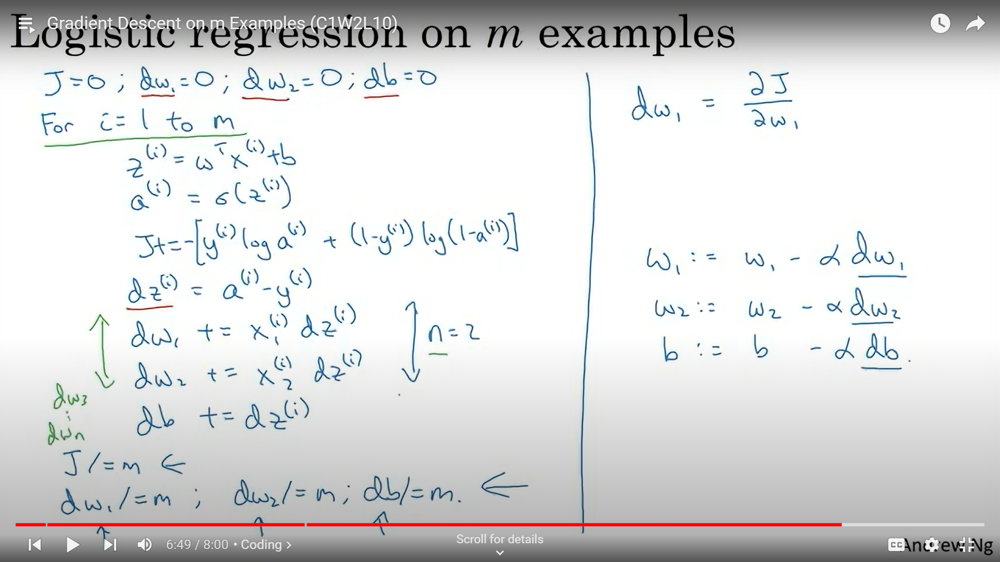

## 6. Vectorization

Using for loops explicitly increases the computational time by a very large factor. So we need to reduce it and it can be done by vectorization.

In for loops if we have $ m $ input images then in will run one after the other for $ m $ times and then if we have $n$ features then it will again run for $n$ times in each of those $m$ iterations.

To avoid this we use vector(matrix) forms in which all the iterations basically takes place simultaneously, hence reducing the computational time.

The bias $b$ is a single real number so in python it broadcasts it according to the dimension of $Z$ which is (1,$m$).

But there still will remain one for loop for the iterations of gradient descent until we get the global optimum.

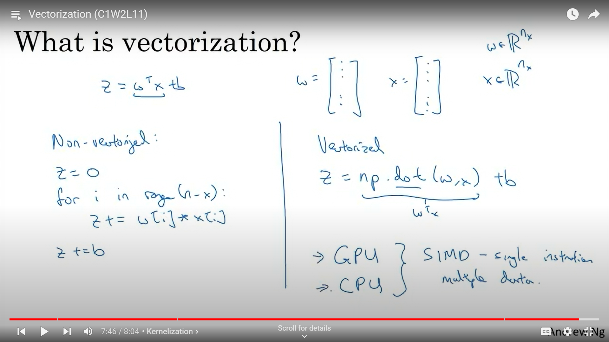

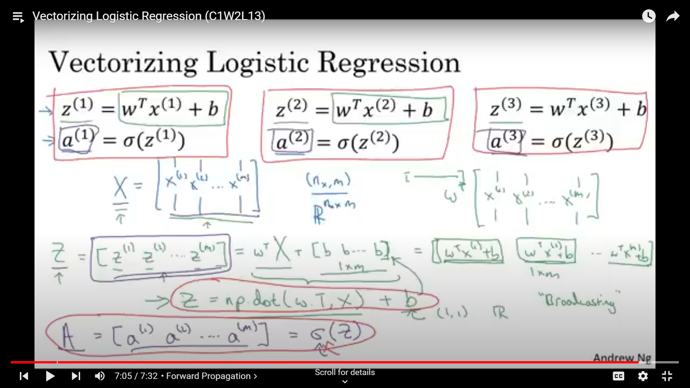

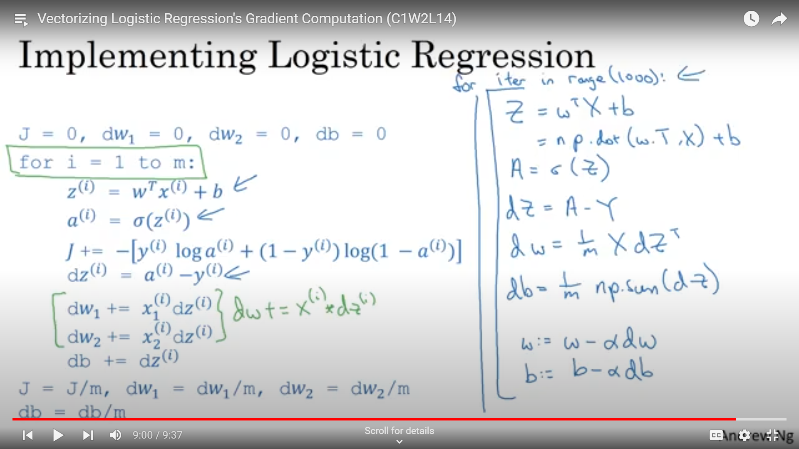
