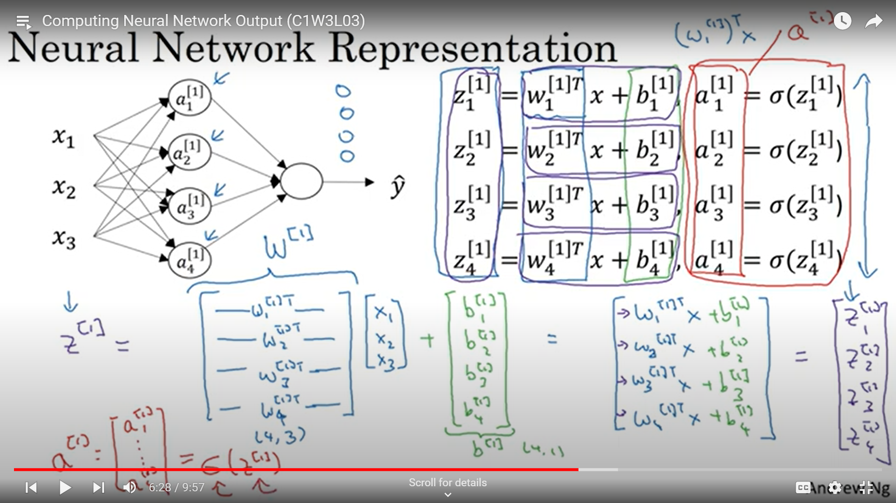
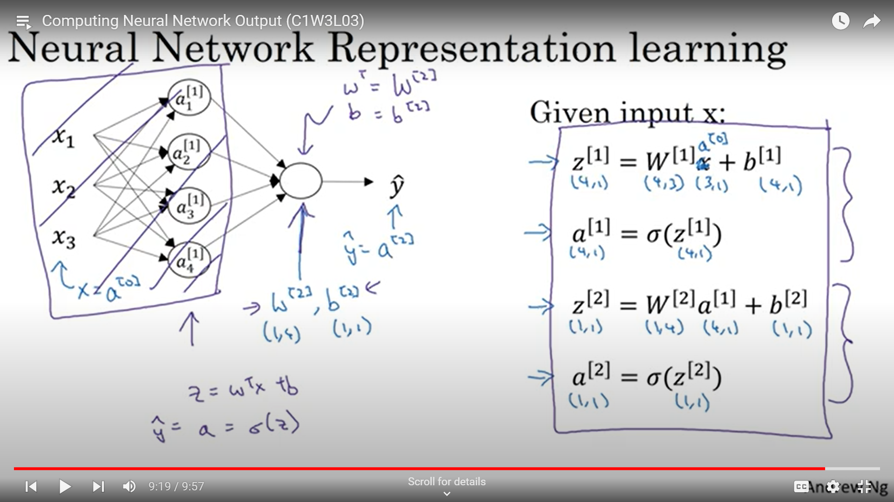
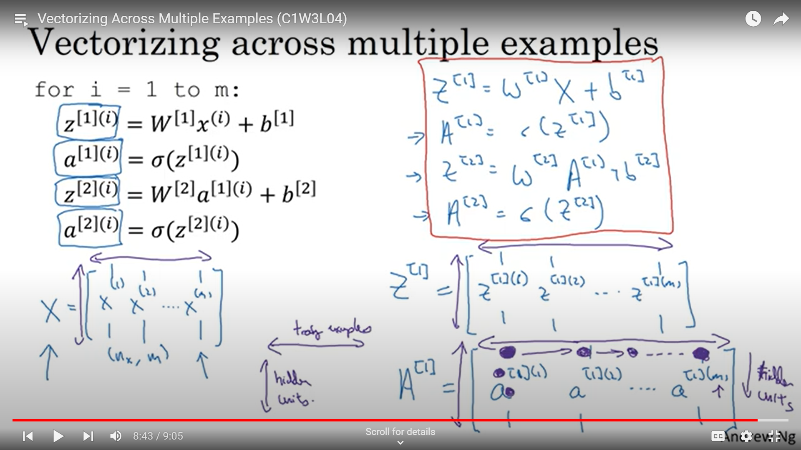
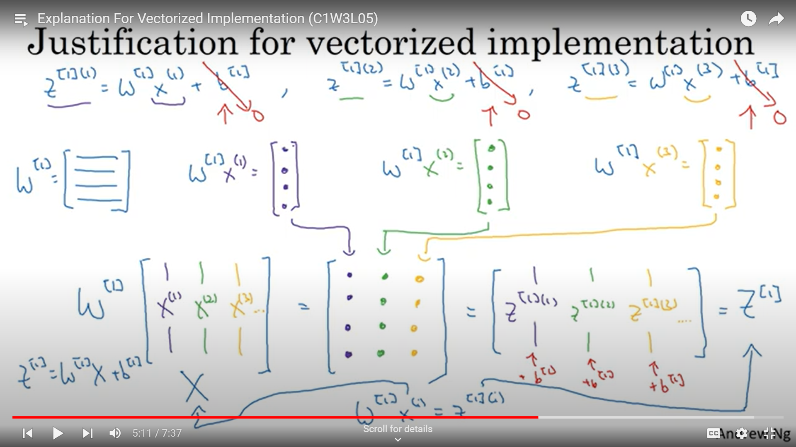
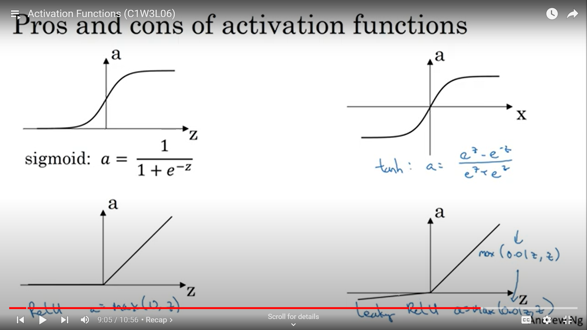
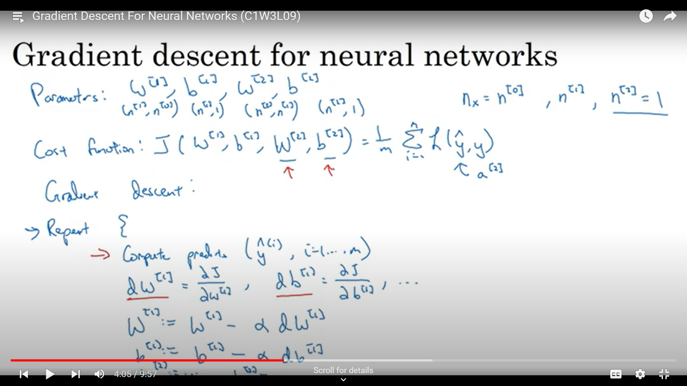
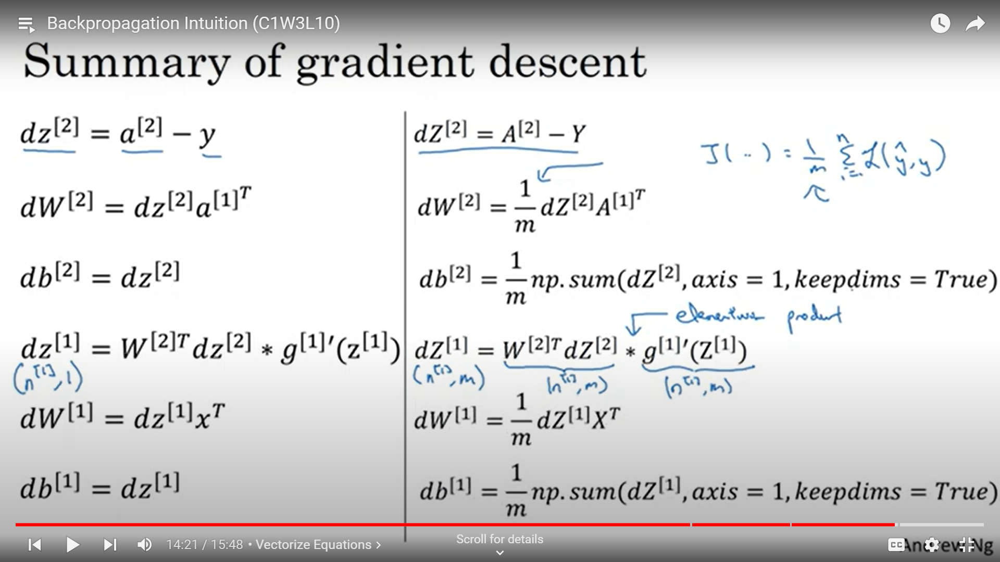
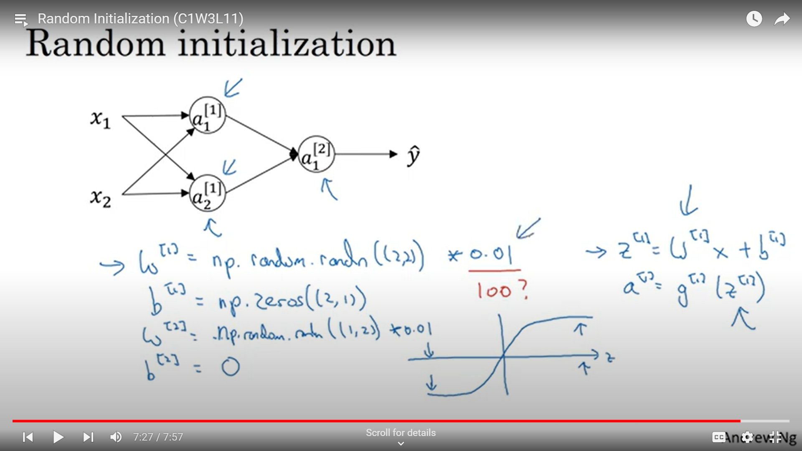

## Neural Network

A 2 layer neural network means 1 hidden layer and 1 output layer, we do not count the input layer. The nodes in a particular layer are denoted by $a$n. Each node will perform 2 operations, first to find $Z$ and second to apply activation function on $Z$.

## Vectorization for each layer in case of 1 input

In the image given above, in the first layer there are 4 nodes so we will get 4 values of $Z$ and hence corresponding 4 values by the activation function.

The dimensions of the matrix of parameters $W$ and $b$ depend upon the number of features extracted from the previous layer and the number of nodes in the present layer.

So in the input layer we have 3 features, hence we will have $w1$,$w2$ & $w3$ for each of the node & there are 4 nodes so we will have (4,3) dimensions for $W$ matrix and $b$ only depends upon the number of nodes in the present layer so $b$ will have dimensions (4,1).

In the image below we can see the vectorized equations with their corresponding dimensions.

## Vectorization for each layer in case of m inputs

We have 4 values of $z$ for each input image as there are 4 nodes in the layer, so dimensions of $Z$ are (4,1). So in case of m input images the dimensions of $Z$ will be (4,m) and consequently dimensions of $A$ will also become (4,m).

## Formulae of different Activation functions

## Gradient Descent for neural networks

In the image below we have written the vectorized formulae for $m$ inputs on the right.

$dZ$ will be calculated for each element of $Z$.

In case of $dW$ matrix, we need to update it after all the $m$ inputs are computed in a particular layer. So we will add all $dw$ we will get by computing all the elements of $dZ$ in a particular node. Basically we will get $m$ number of values of $dW$ which are added together and then their mean is taken. So we can see that the formulae has a factor of $1/m$. Same goes for $db$.

## Random Initialization

We cannot initialize the $W$ matrix as 0(np.zeroes) like in case of logistic regression because then all the nodes in a particular layer will be computing the same value for a given input image and it does not make sense to have a neural network at all.

So we need to randomly initialize the values, which is shown below in the image.

We multiply by a very small factor(0.01) to have very small random values because at big values of the parameters we will recieve big values of $Z$(both -ve and +ve) and we can see that the graph of the activation(sigmoid) function is almost flat at big values of $Z$ and it will decrease the learning rate(i.e slow down the learning process).

