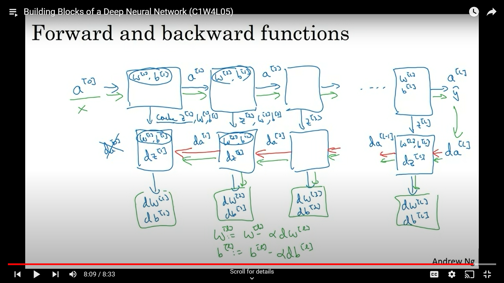
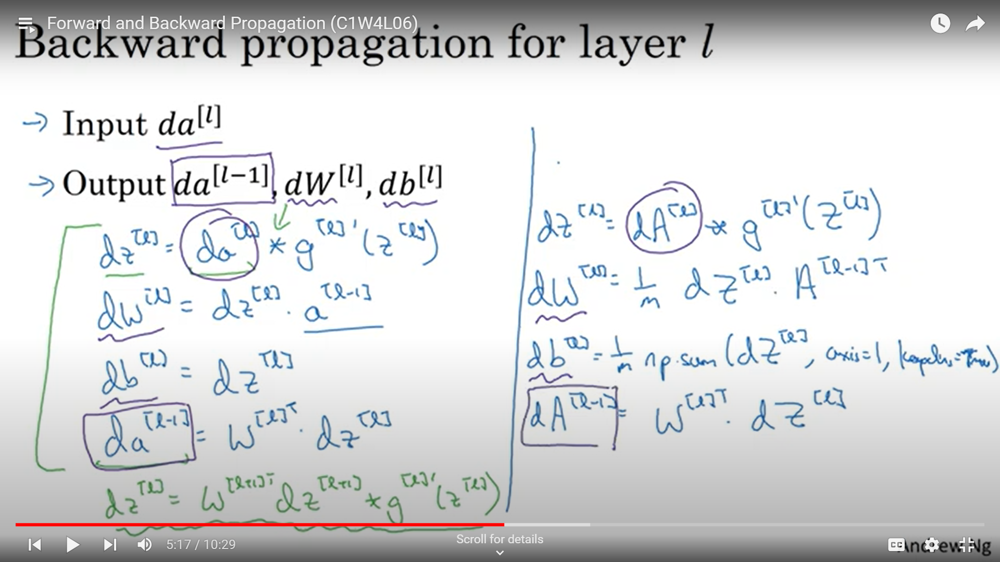
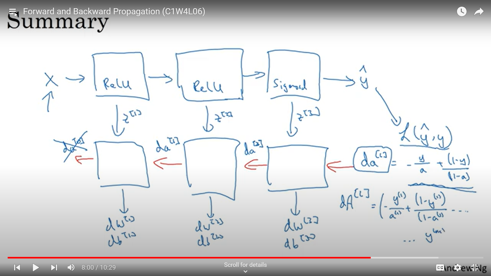
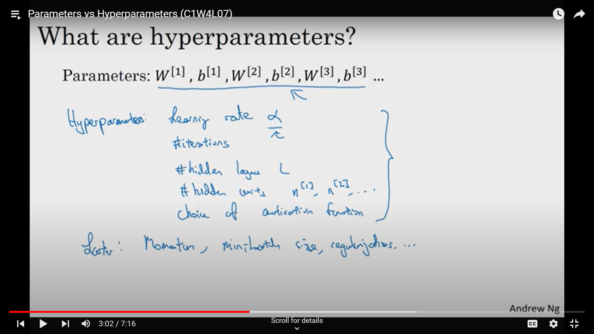

## Neural network with multiple layers

## General formulae for backpropagation

## Summary

## Hyperparameters

Hyperparameters are variables on which paameters $w$ and $b$ depend.

Most optimum hyperparameters for a particular neural network are found by trying and testing it out.

In the image below different hyperparameters are mentioned.

