## Neural networks and datasets

First we need to split the dataset into train/dev or train/dev/test sets. Majority of the dataset is used in training and small amount of dataset is used for cross-validation(dev set) which gives us an idea about accuracy of the model. In cross-validation we use different set of parameters on the same data and find the accuracy and finally, choose the most optimum set of parameters for the model. Using the model on test cases is optional.

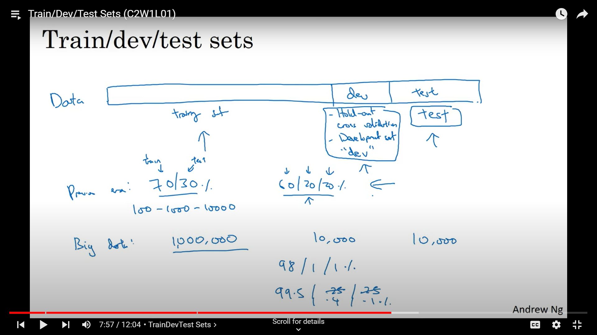

## Bias and Variance

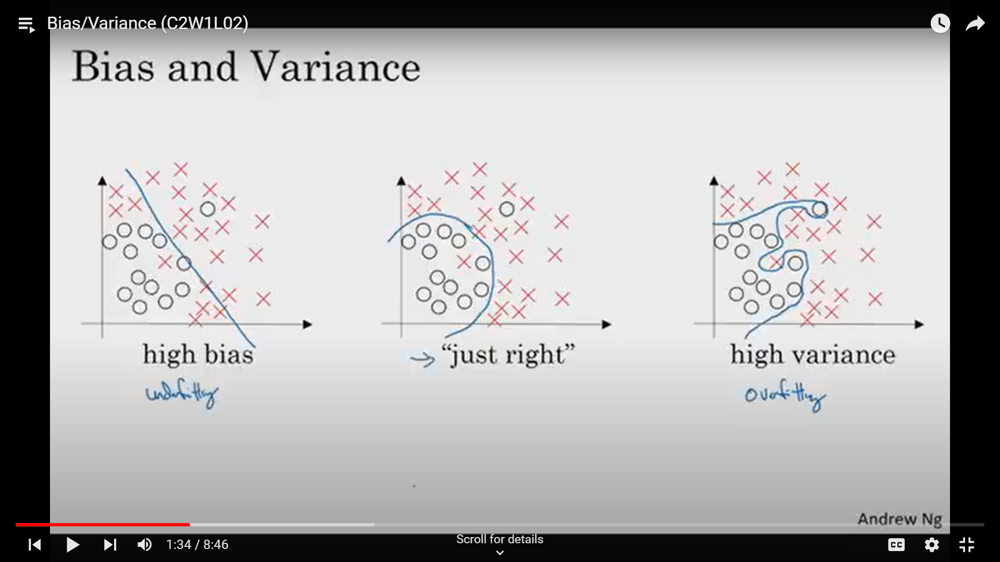

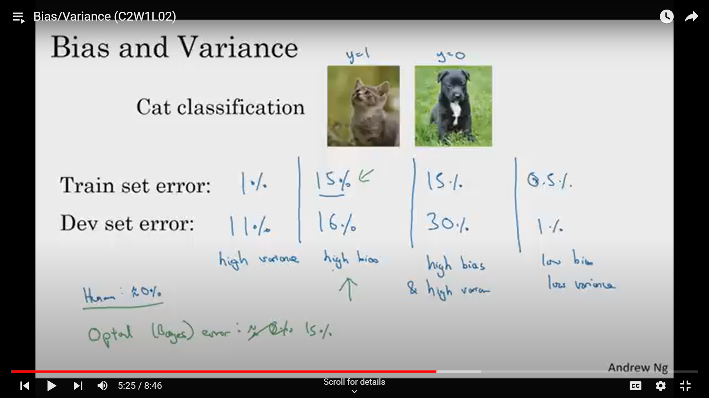

Underfitting(High Bias) happens when a model is too simple to capture the underlying patterns in the data. This means the model performs poorly on both the training data and the test data.

Bias is therefore responsible for train set error. Low Bias results in low train set error while High Bias results in high trainn set error.

Overfitting(High Variance) is a common issue in machine learning where a model learns not just the underlying patterns in the training data but also the noise and specific details unique to that data. This results in the model performing exceptionally well on the training data but poorly on new, unseen data.

Variance is therefore responsible for dev set error. Low Variance results in low dev set error while High Variance results in high dev set error.

So for the neural network to work decently we need low bias and low variance.

## Different ways to rectify high bias & high variance

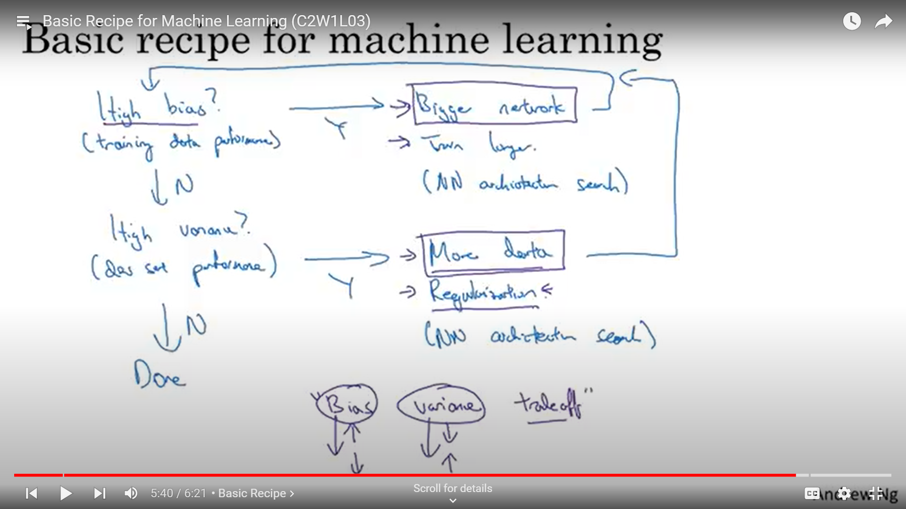

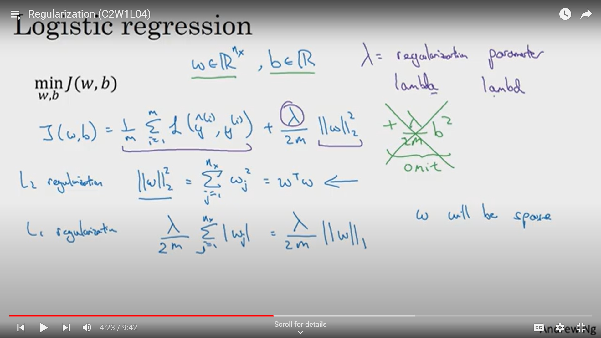
There are many different types of regularization. L1,L2 & Dropout regularization are some of them mentioned below.

### L1 and L2 regularization

L1 regularization adds a penalty proportional to the absolute value of the weights to the loss function.

L2 regularization adds a penalty proportional to the square of the weights to the loss function.

In both L1 & L2 regularization a new term is added in loss(cost)function, so during gradient descent we get an extra term in $ dw$ which shrinks the weights of the features.

In L1 wee can get some weights reduced to 0 if lambda has large value. But in case of L2, weights can not be reduced to exactly 0 as lambda is multiplied by $w$ & the value of $w$ decreases hence the whole term also decreases which is being subtracted from $w$ even when lambda is large.

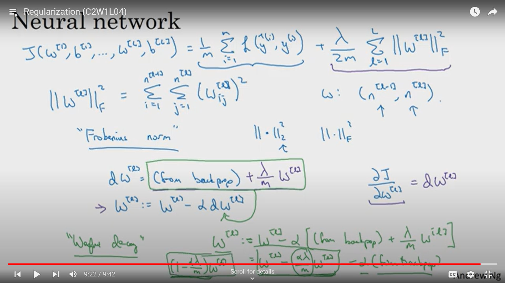

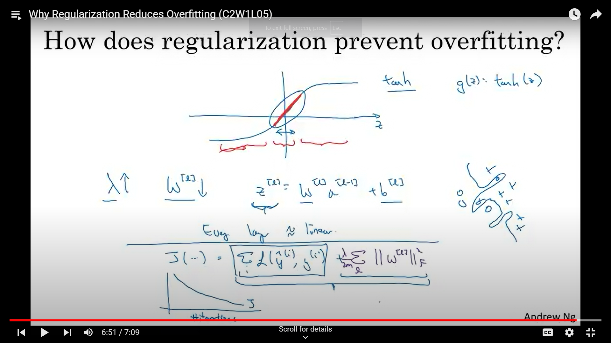

By regularization we achieve weight shrinkage and it results in lower value of $Z$. From the image above we can see that at lower values of $Z$ the activation function is linear which simplifies the learning model, thus preventing overfitting.

### Dropout regularization

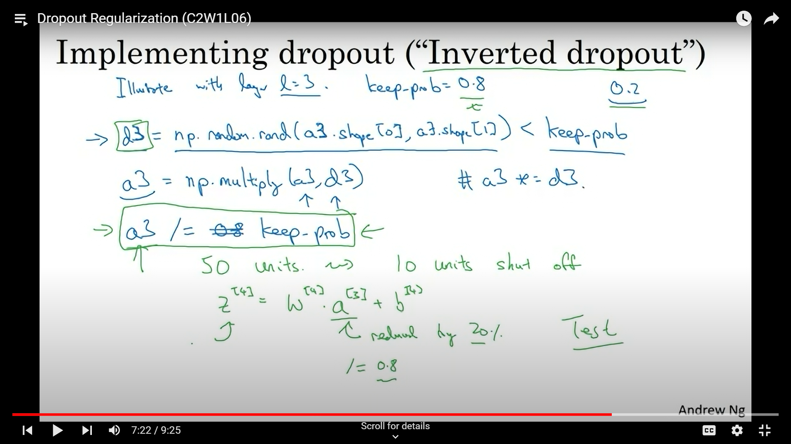

Dropout is a regularization technique that helps prevent overfitting in neural networks by randomly setting a fraction of input units to zero at each update during training. This makes the network less sensitive to the specific weights of neurons, promoting more robust learning.

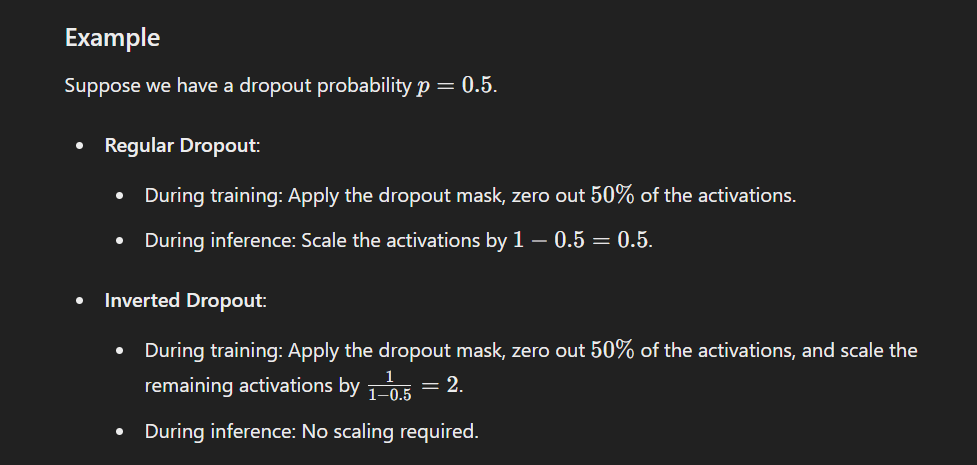

We can set the probability of shutting off neurons for each layer individually.

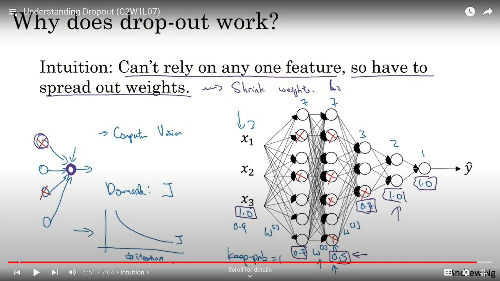

### Other regularization methods

Different angles and variations of the same data set(Data Augmentation) this will help in generalizing outputs and reduce overfitting.

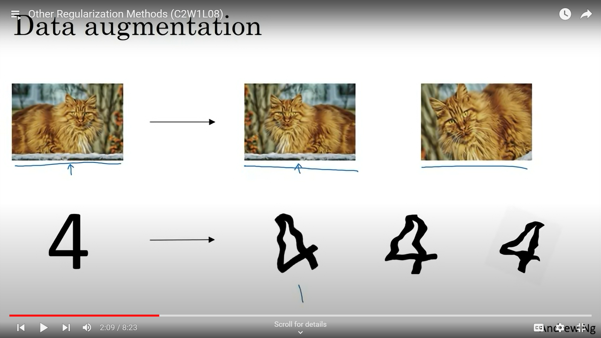

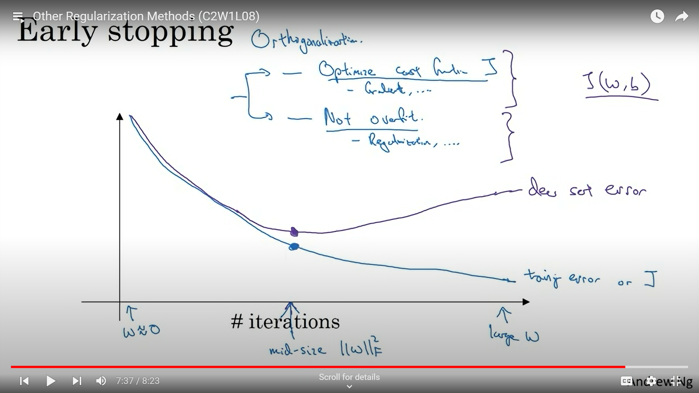

Split the Data: Divide the data into training and validation sets.

Train the Model: Train the model on the training set while evaluating its performance on the validation set at regular intervals (e.g., after each epoch).

Monitor Performance: Track a performance metric, such as validation loss or validation accuracy, to detect when it stops improving.

Patience: Set a patience parameter, which defines the number of epochs to wait for an improvement in the performance metric before stopping the training. If the performance doesn't improve for a specified number of epochs, stop training.

Save the Best Model: Optionally, save the model with the best performance on the validation set.

## Normalizing inputs

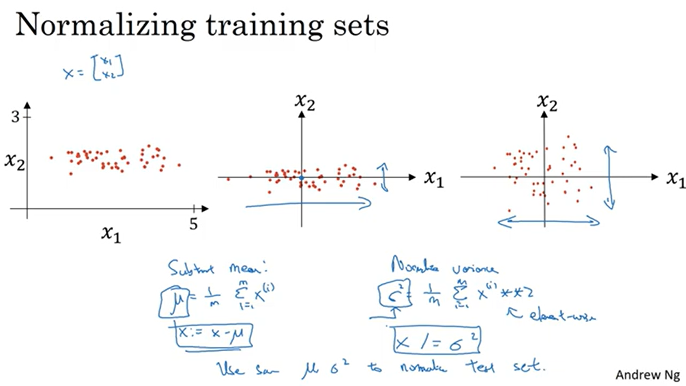

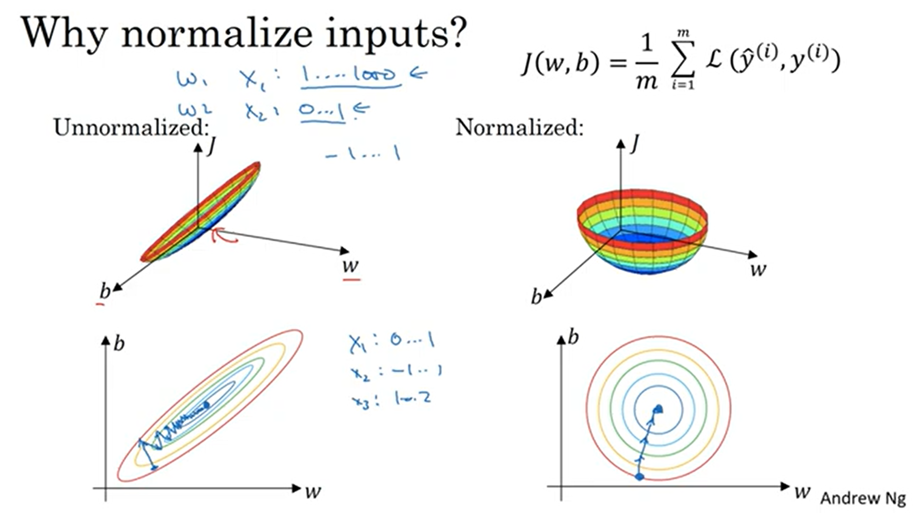

Improves Performance: Many machine learning algorithms perform better when the input data is normalized. This includes algorithms like gradient descent-based optimizers, k-nearest neighbors (KNN), and support vector machines (SVM).

Equal Contribution: Ensures that each feature contributes equally to the model, which is important for algorithms that calculate distances between data points.

Accelerates Convergence: In neural networks, normalization can help the model converge faster during training.

## Weight Initialization

Basically we do not want very large magnitude of $Z$ because after applying activation functions the gradient descent becomes very low at large values of $Z$ which slows down the learning rate.

Also we do not want very small values of $Z$ which results in very small activations which will also lead to slow learning rate.

This in turn leads to vanishing or exploding gradients.

So we need to initialize values of $w$ accordingly. Such that activations are not very small also not very big.

In the image below the preffered weight initializations for corresponding activation functions are given.

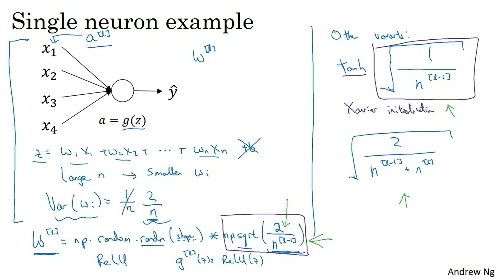

## Gradient check for neural network

Gradient checking involves comparing the gradients computed by backpropagation with numerical approximations of the gradients. The numerical gradient is computed using the central difference formula, which is based on the definition of the derivative.

Implement Forward and Backward Passes: Ensure your model can perform forward and backward passes to compute loss and gradients.

Flatten Parameters and Gradients: Convert the model parameters and corresponding gradients into flattened vectors.

Compute Numerical Gradients: Use the central difference formula to approximate the gradients numerically.

Compare Gradients: Compare the analytical gradients obtained from backpropagation with the numerical gradients to check for discrepancies.

Investigate and Fix Discrepancies: If there are significant differences between the analytical and numerical gradients, investigate and fix any errors in the backpropagation implementation.

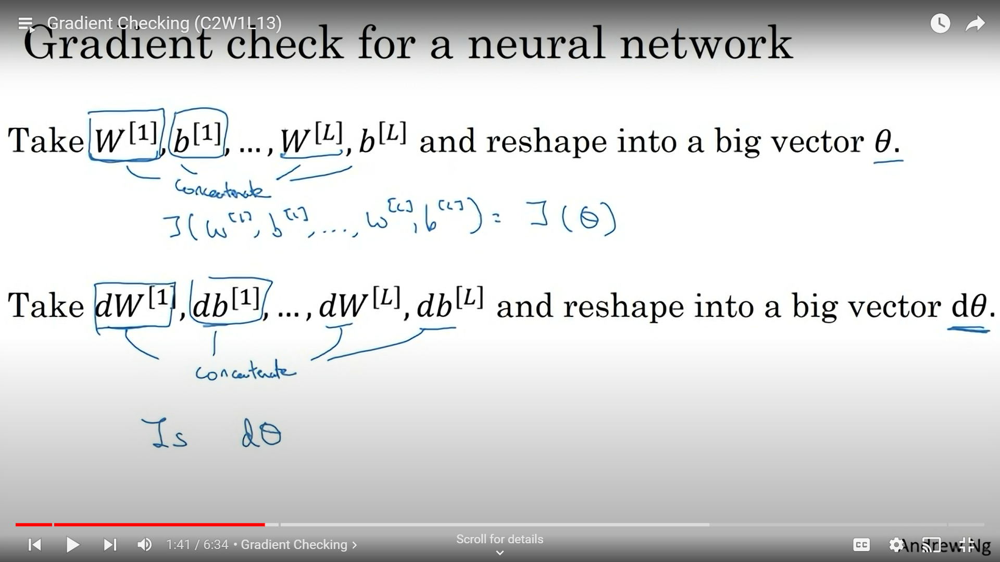

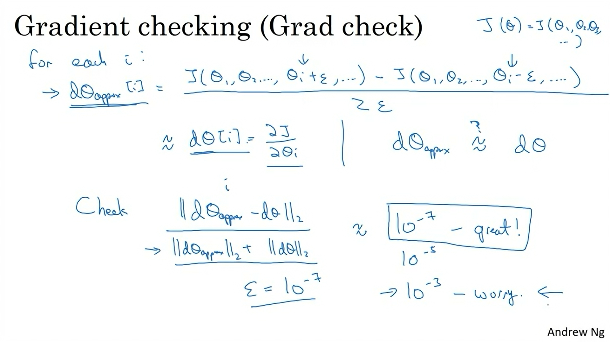

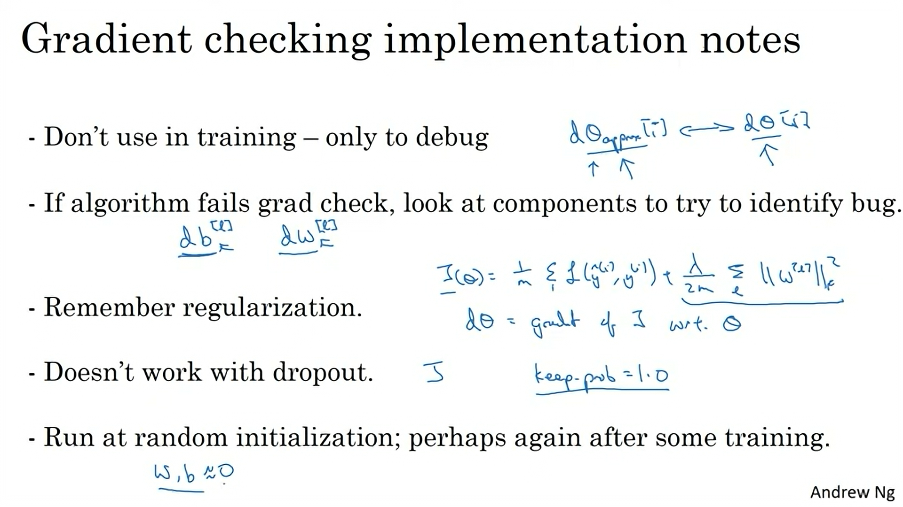
