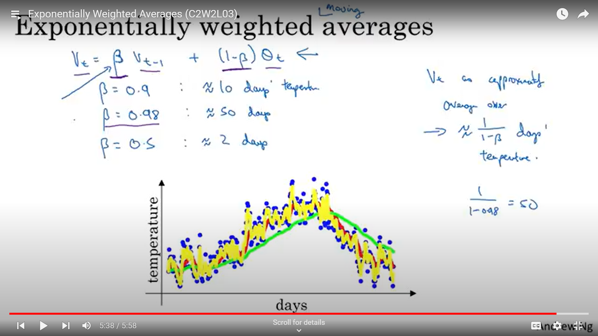
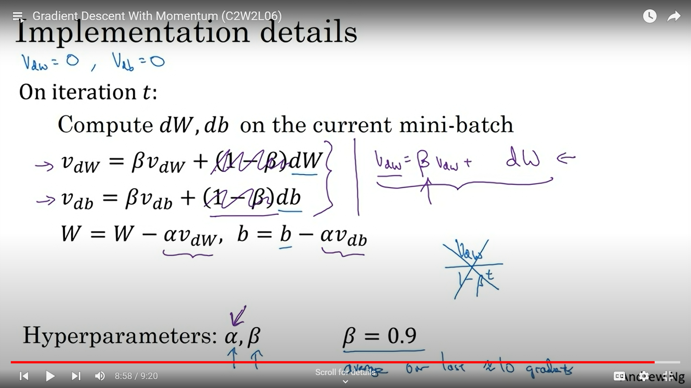

## Mini-batch gradient descent

The images below are self explanatory.

Mini-batch size should be chosen between 1 & $m$ and in powers of 2 prefferably because it aligns with the memory architecture of GPUs. If we choose size as 1(stochastic mini batch) then the parameters will move around a set of values but never converge while batch size of $m$ takes too long to compute.

## Exponentially Weighted Averages

## Gradient descent with momentum

Gradient descent with momentum is an optimization technique designed to accelerate the convergence of gradient descent algorithms by incorporating the concept of momentum from physics. This approach helps to dampen oscillations and accelerates movements in the relevant direction.

We use the concept of exponentially weighted averages here to dampen the oscillations and also accelerate in the direction of global optimum.

During gradient descent we update the parameters by subtracting the exponentially weighted average of gradients $dw$ and $db$.

In the momentum update equation for gradient descent, we typically see the term without the (1-&#946;) factor when updating the velocity. This is because the (1-&#946;) factor is implicitly accounted for in the learning rate.

## RMSprop

Here, just like momentum we use exponentially weighted averages on squared gradients $dw$2 to dampen oscillations and accelerate towards global optimum.

The parameters are updated as shown in the image below.

## Adam optimization

Adam optimization(Adaptive moment estimation) is a combination of momentum and RMSprop.

Equations are shown in the image below.

## Hyperparameters choice

In the image below the values which are used most frequently for the corresponding hyperparameters are mentioned.

## Learning rate decay

Initial Rapid Learning: A high learning rate at the beginning of training allows the model to learn quickly and escape local minima that may not be optimal. This rapid learning phase helps the model cover a broader area of the loss landscape.

Refined Learning: As training progresses, reducing the learning rate allows for finer adjustments to the model parameters. This helps in stabilizing the learning process and ensures that the model converges to a more precise solution without overshooting the optimal point.

Avoiding Overfitting: By starting with a high learning rate, the model is less likely to memorize noisy data early on. As the learning rate decays, the model can start to learn more complex patterns without being misled by noise in the data.

### Learning rate decay methods

