# CASE STUDIES

## LEX-NET-5

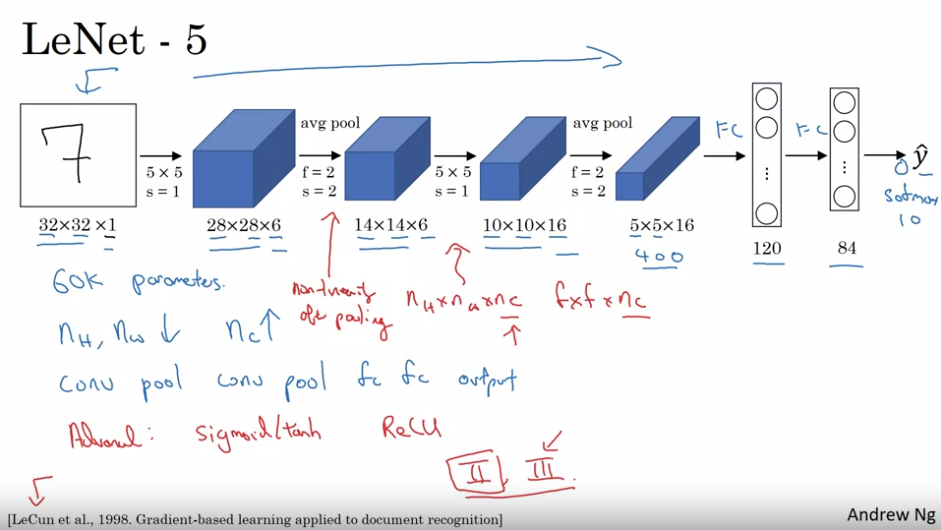
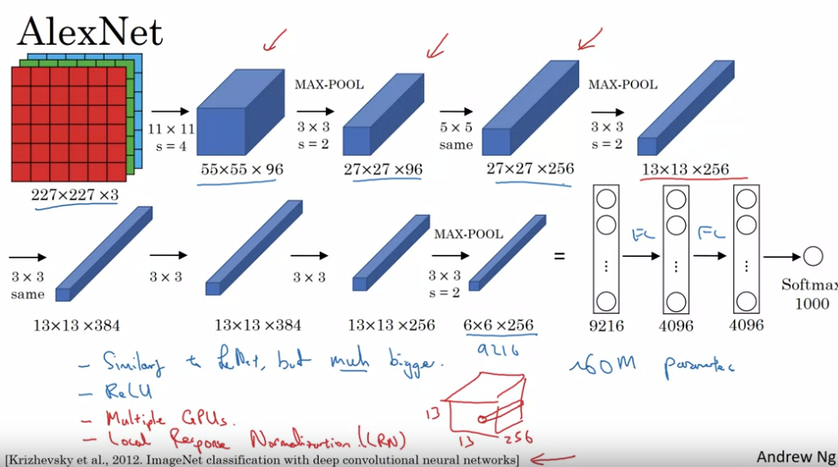
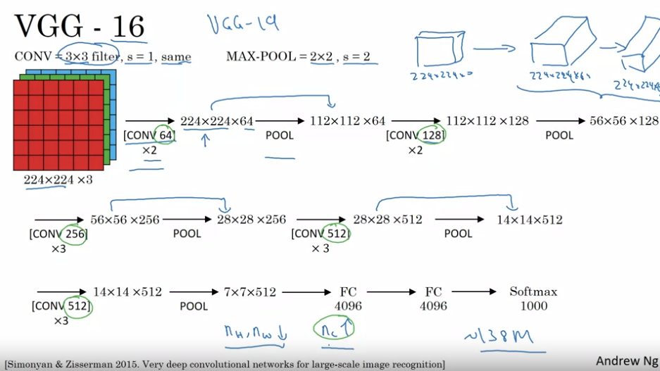

## RES-NETS

ResNets introduce skip connections that allow the gradient to flow more easily through the network during backpropagation. These connections bypass one or more layers by adding the input of the residual block to its output.
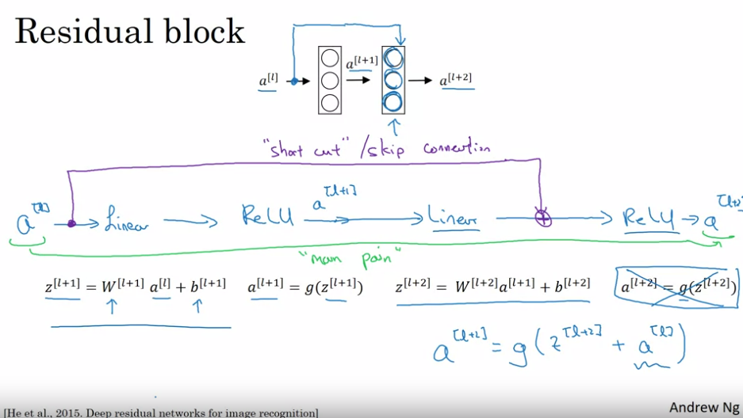
And what goes wrong in very deep plain nets in very deep network without this residual of the skip connections is that when you make the network deeper and deeper, it's actually very difficult for it to choose parameters that learn even the identity function which is why a lot of layers end up making your result worse rather than making your result better. And I think the main reason the residual network works is that it's so easy for these extra layers to learn the identity function that you're kind of guaranteed that it doesn't hurt performance and then a lot the time you maybe get lucky and then even helps performance. At least is easier to go from a decent baseline of not hurting performance and then great in decent can only improve the solution from there.
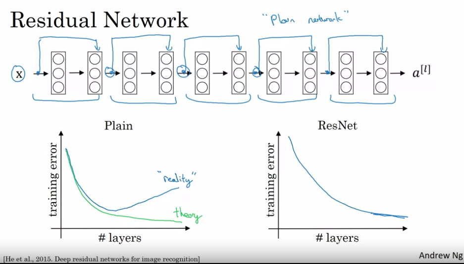
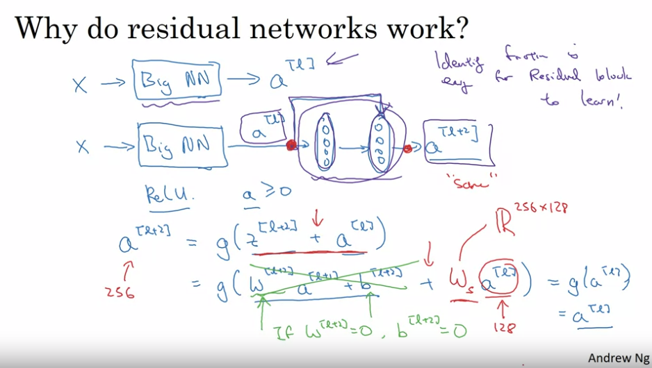

## USING 1x1 CONVOLUTIONS

One way to think about a one-by-one convolution is that it is basically having a fully connected neural network that applies to each of the 62 different positions. What that fully connected neural network does is it inputs 32 numbers and outputs number of filters, outputs. I guess the payer notation, this is really a nc of 0 plus 1 if that's the next layer. By doing those at each of the 36 positions, each of the six by six positions, you end up with an output that is six-by-six by the number of filters. This can carry out a pretty non-trivial computation on your input volume. This idea is often called a one-by-one convolution, but it's sometimes also called network in network
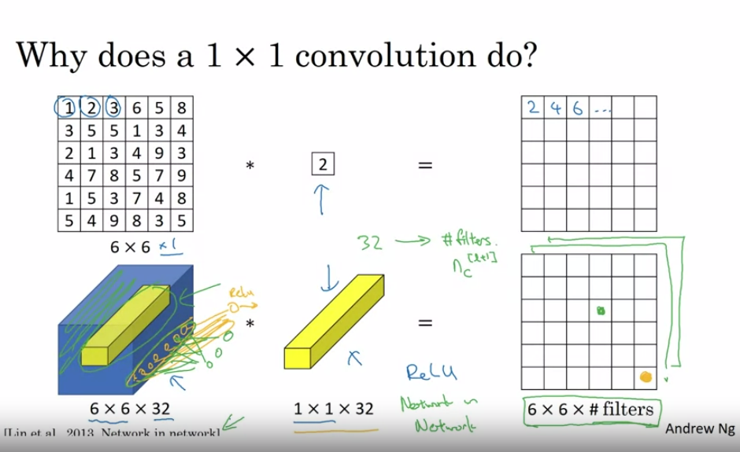  
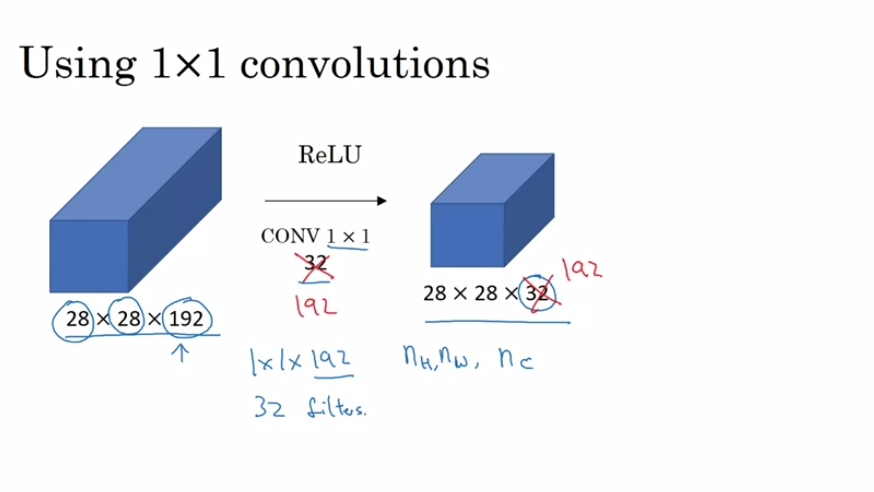

## INCEPTION NETWORK

Instead of using a single type of filter size, the Inception network uses different sizes of filters (e.g.,1×1, 3×3, 5×5) in parallel. This allows the network to capture features of different sizes and details at the same time.
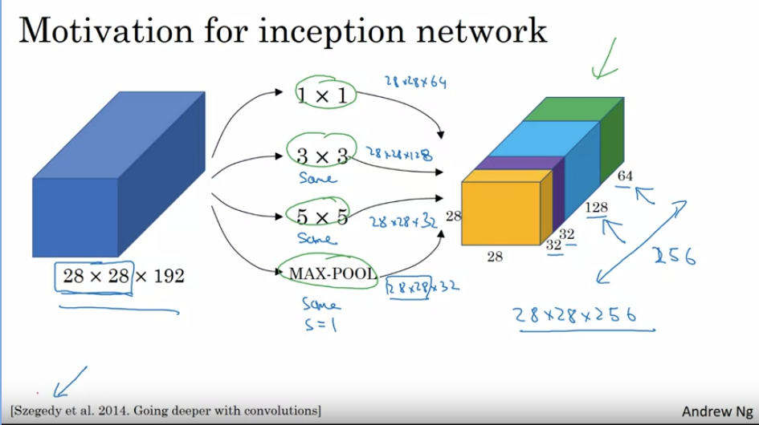
These filters work side-by-side in the same layer, and their outputs are concatenated. This means that the network can analyze images more comprehensively.
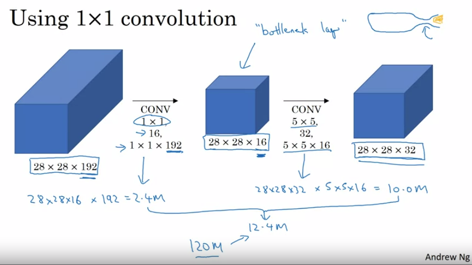
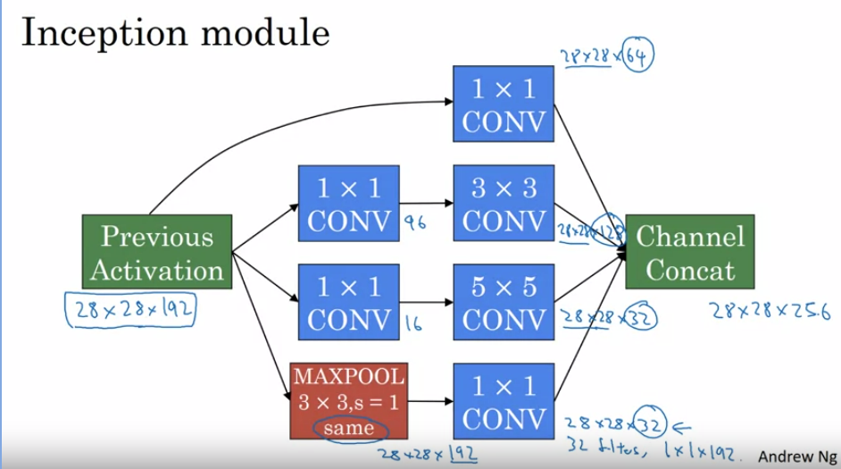
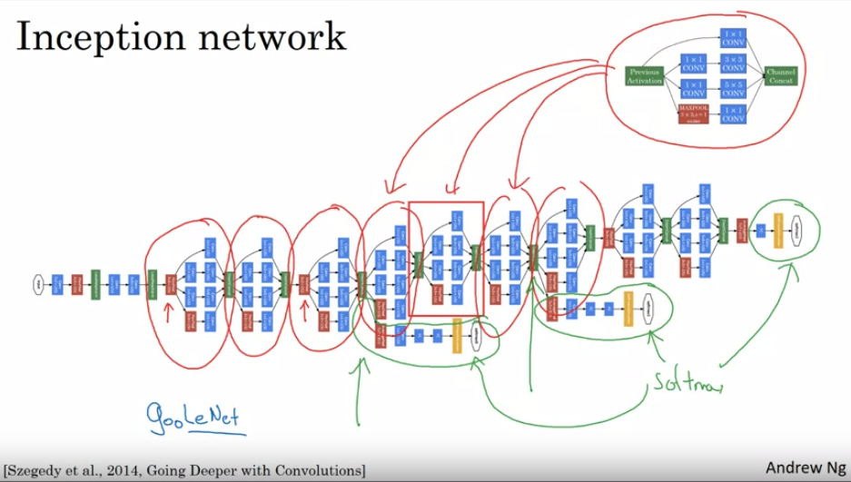

## MOBILE- NET

First we do a depthwize convolutions and then followed by pointwize convolution.

Depthwize convolution is bassically multiply the red filter with red inpt ans so on and in output we get 4*4*3 output then it is followed by pointwise convolution.
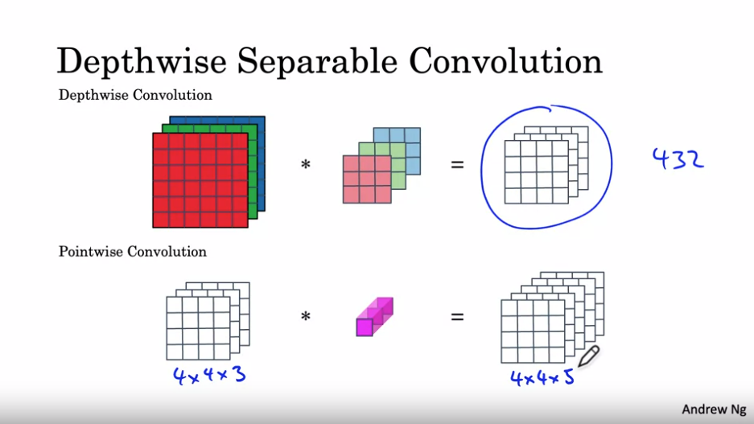
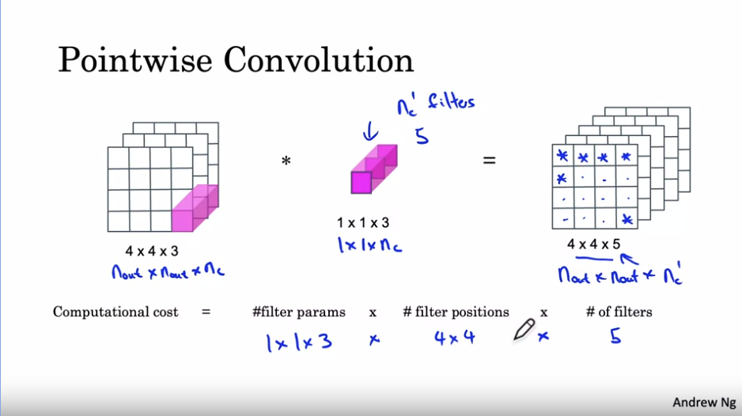
This approach significantly reduces the computational cost.
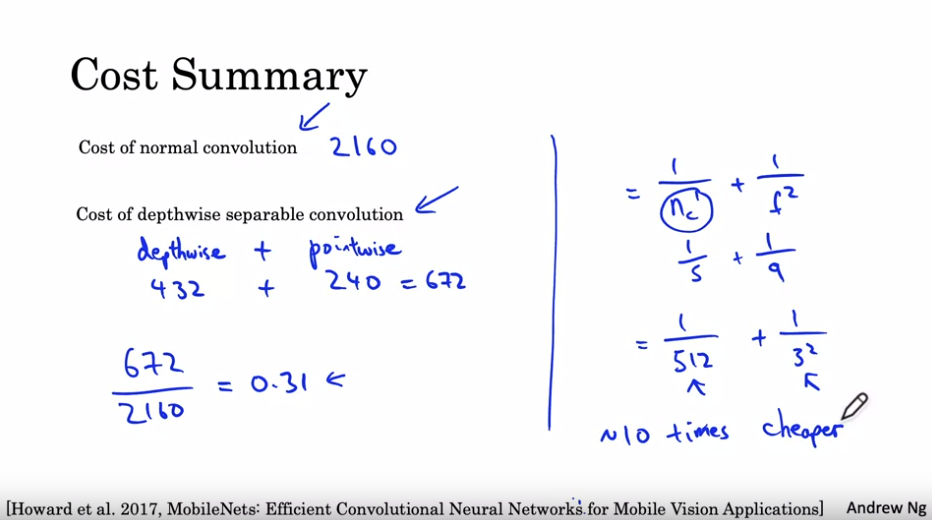
Moblienet v2 is more better as we add residual connection in between
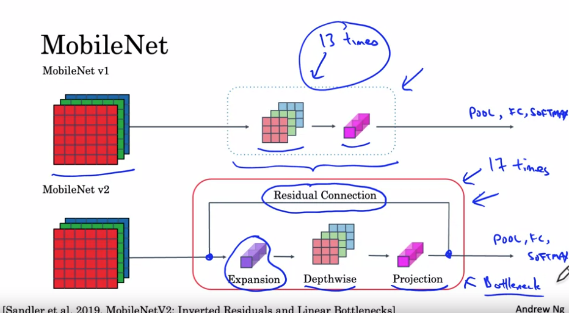
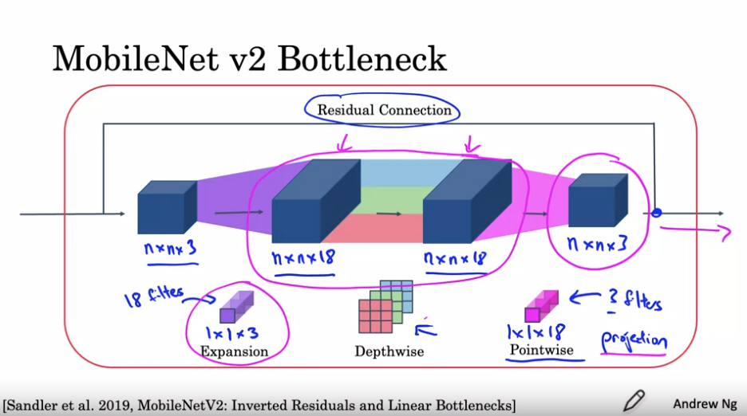

## TRANSFER LEARNING

When you have less data for training a certain NN we can use transfer learning where we freeze the certain part of another neural network and put the inputs of the needed NN .
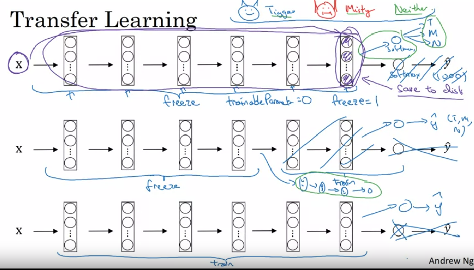

## DATA AUGMENTATION

We do data augmentation when we want to incearse the data in the dataset , following are the way:
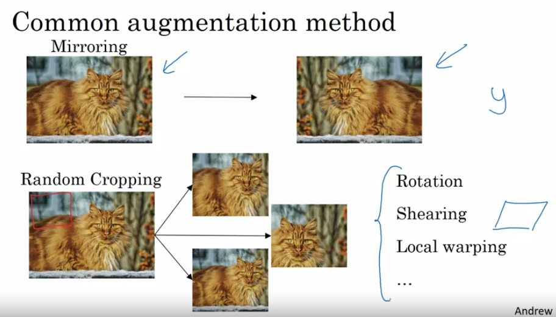
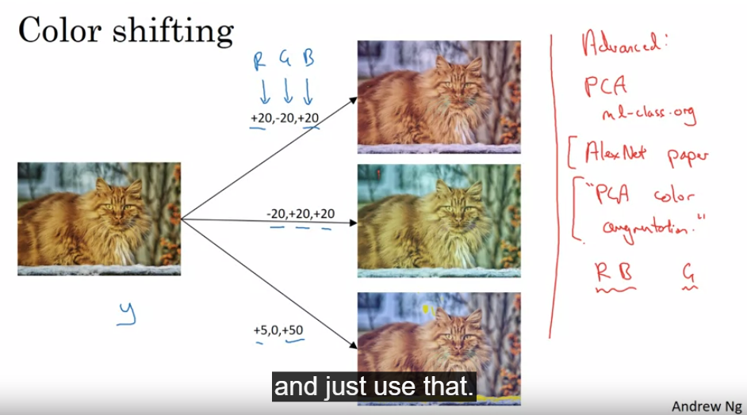
