# COURSE4-WEEK4

## FACE RECOGNITION

### ONE SHOT LEARNING

One-shot learning is a type of machine learning where a model is trained to recognize new classes or categories based on only one or a few training example
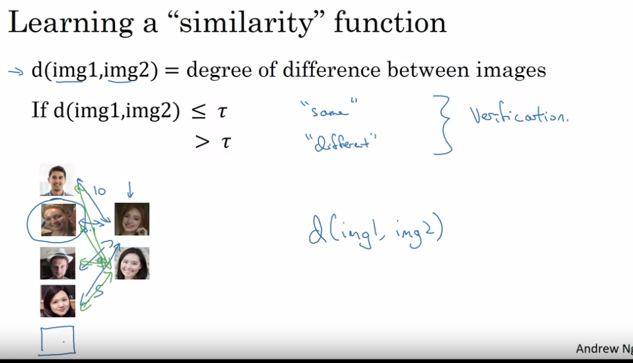

### SIAMESE NETWORK

It compares the encoding of the two images and checks if the difference betwwen the ecodings and decides accprdingly if the images are similar or not
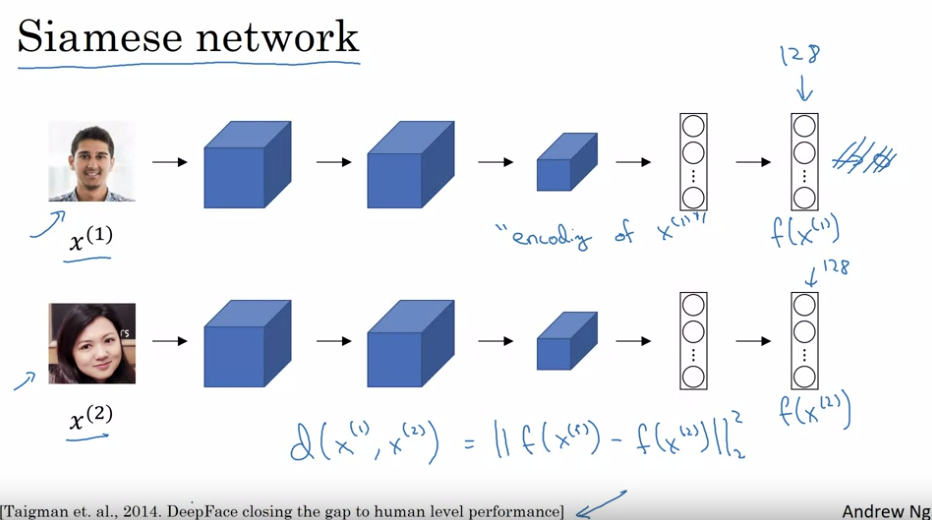
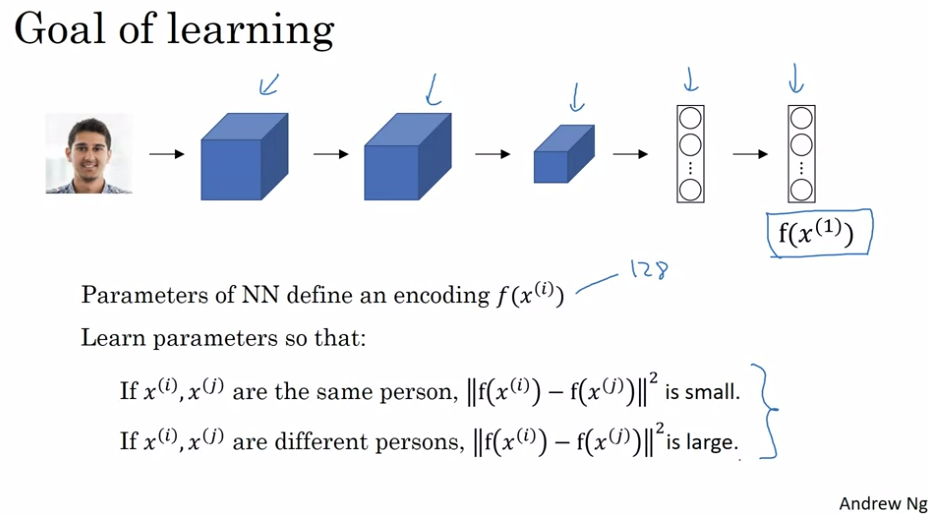

### TRIPLET LOSS

The goal of triplet loss is to ensure that embeddings of similar items (positive) are closer to each other than to those of dissimilar items (negative) in the embedding space.
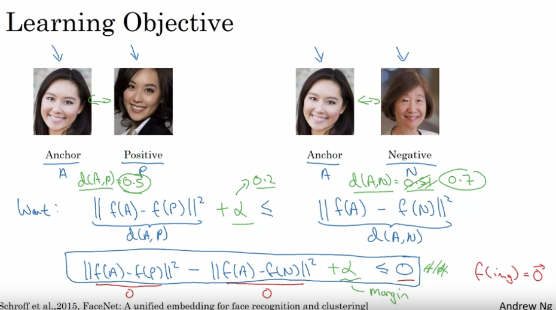
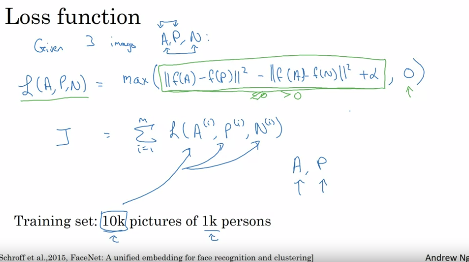
Anchor (A): The reference input (e.g., a face image of person X).

Positive (P): An input of the same class as the anchor (e.g., another face image of person X).

Negative (N): An input of a different class than the anchor (e.g., a face image of person Y).

The goal is to minimize the distance between the anchor and positive while maximizing the distance between the anchor and negative, ensuring that dissimilar examples are well separated in the learned embedding space.
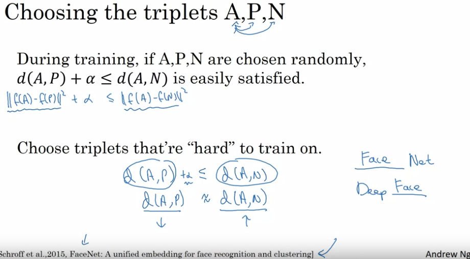
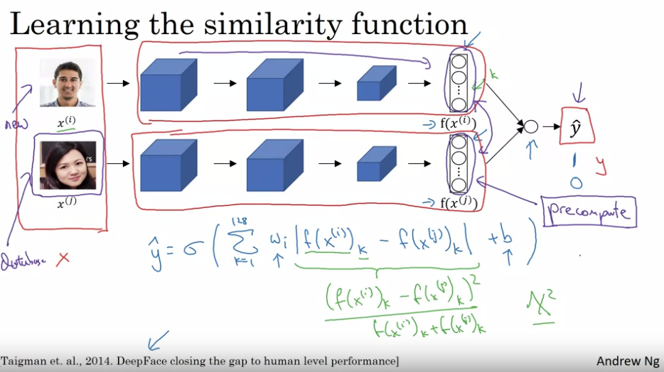

## NEURAL STYLE TRANSFER

Neural Style Transfer (NST) is a technique that applies the artistic style of one image (the "style image") to another image (the "content image").
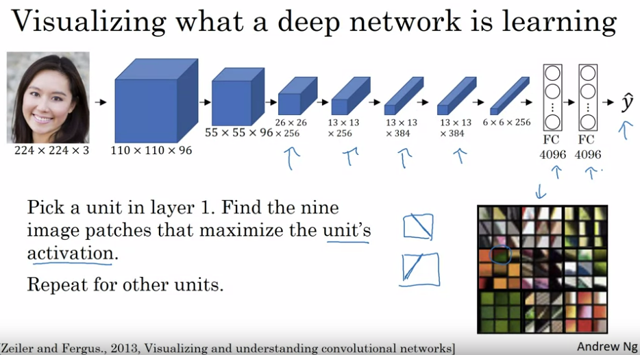
Here we can see that initial layers of the covnet checks for simpler objects line edge detection but as we go deeper the complextity of the image increases
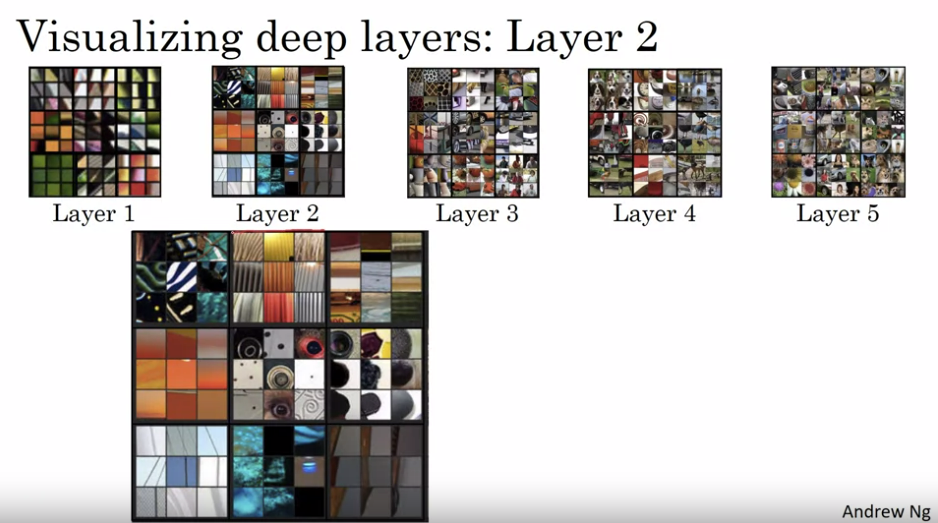

### COST FUNCTION

Content Loss captures the structure and content of the content image.
Style Loss captures the artistic patterns, colors, and textures of the style image.
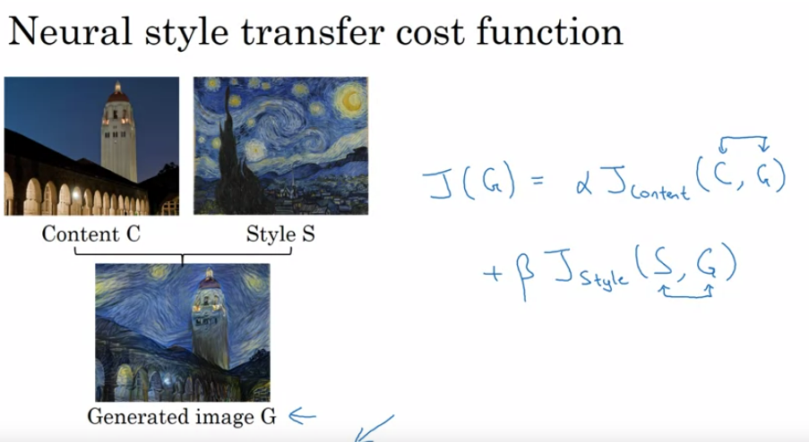
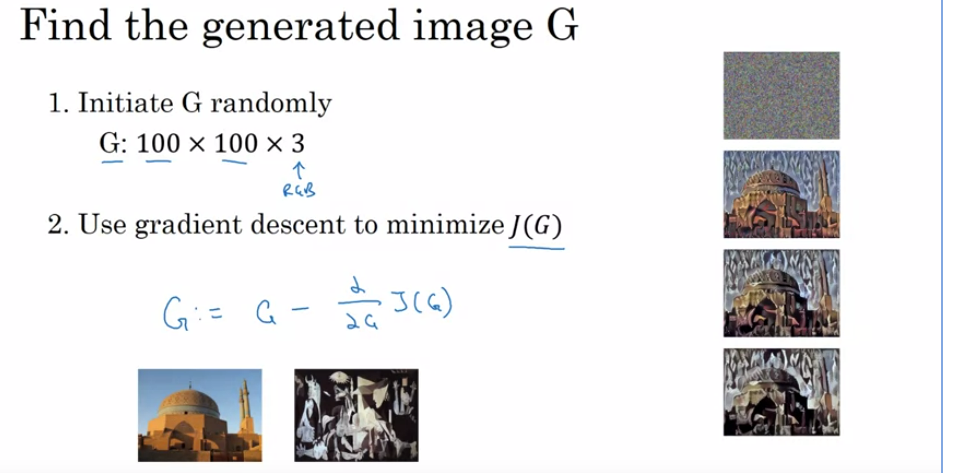

### CONTENT COST FUNCTION

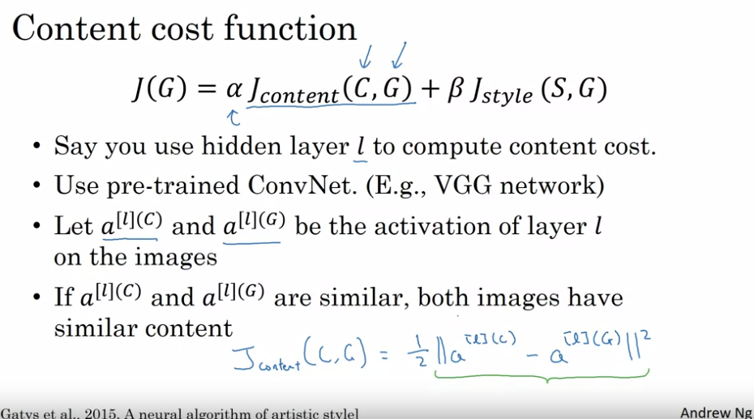

### STYLE COST

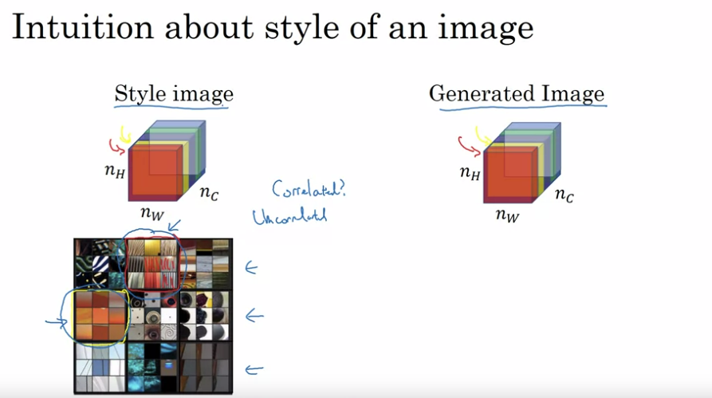
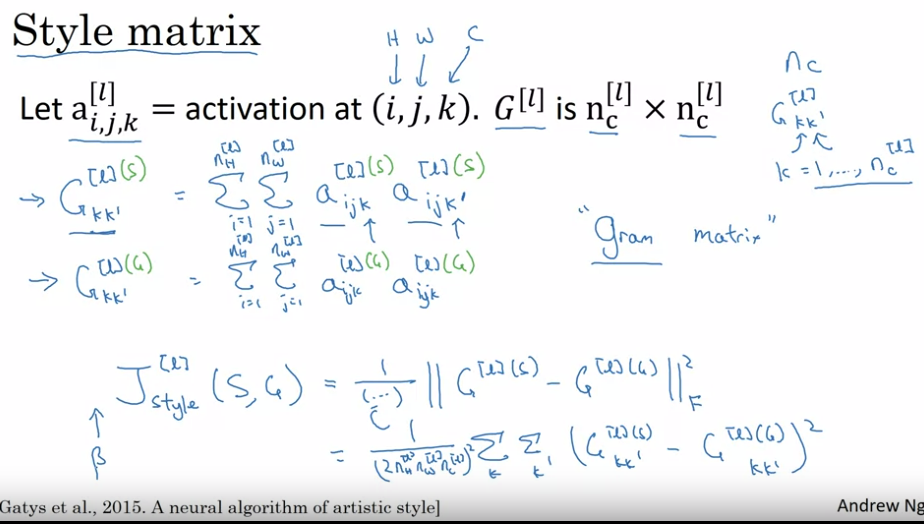
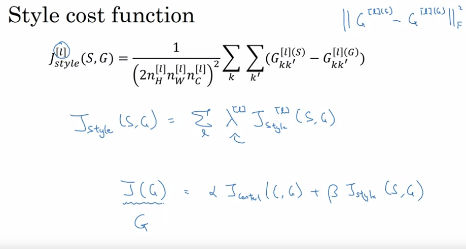

## 1D & 2D GENERALIZATION

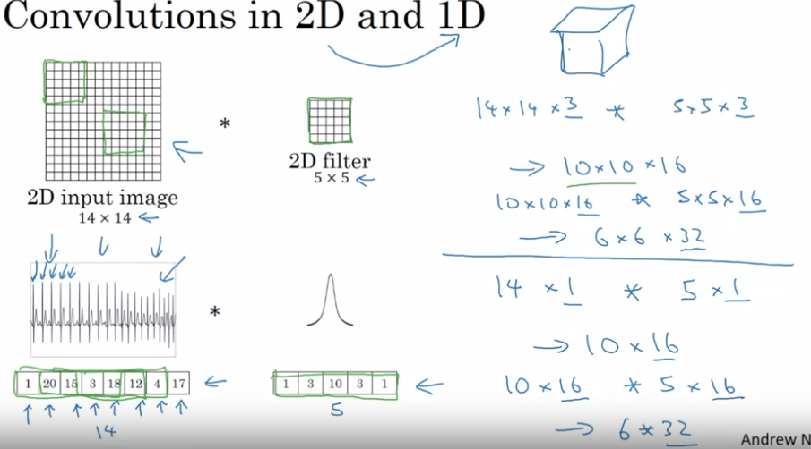
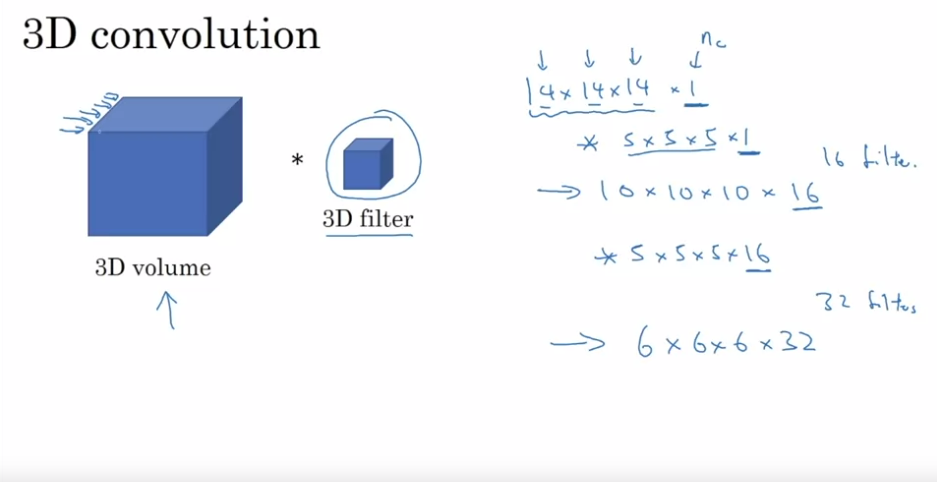
